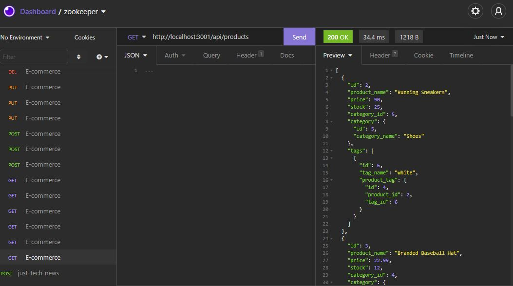

# E-Commerce App

## Description
Allows the user to check their e-commerce website, being able to see different categories, products and tags.

## Built With
* MySql
* Sequelize
* Express
* JavaScript

## Installation 
You can clone the code from my repo to your local computer and run the application through your local server or through Insomnia.

## Usage

## Video
https://watch.screencastify.com/v/GXLjJ0S4nGBmEH2m88FA

## Questions
undefined
   
  Find me on GitHub 🏆: [Hunyeh](https://github.com/Hunyeh)
   
  ✉️ If any additional questions, email me @ : doringhunter@yahoo.com